 

  

---

## `> SOBRE MÍ`

Soy **Keiner García**, desarrollador de software enfocado en convertir ideas en soluciones funcionales.

Me interesa construir software combinando **desarrollo, análisis, diseño, bases de datos y automatización**, buscando siempre soluciones modernas y mantenibles.

También trabajo con **los nuevos modelos de inteligencia artificial**: integro LLMs (OpenAI, Claude, Gemini, DeepSeek, Hugging Face) en productos reales, diseño agentes y automatización inteligente, y aplico técnicas como RAG y prompt engineering para obtener resultados precisos.

---

## `> TECNOLOGÍAS`

### Lenguajes

### Desarrollo

### Bases de datos y backend

### Herramientas

---

# `> INTELIGENCIA ARTIFICIAL`

---

## `> LO QUE CONSTRUYO`

---

## `> ENFOQUE ACTUAL`

---

# `> ACTIVIDAD`

  

<picture>
  <source media="(prefers-color-scheme: dark)" srcset="https://raw.githubusercontent.com/keinergarcia/keinergarcia/output/github-snake-dark.svg"/>
  <source media="(prefers-color-scheme: light)" srcset="https://raw.githubusercontent.com/keinergarcia/keinergarcia/output/github-snake.svg"/>
  
</picture>

---

# `> LOGROS`

---

# `> CONTACTO`

  

  

  

  

<i>¿Un proyecto en mente? Escríbeme por WhatsApp, Telegram o correo. Respondo lo antes posible.</i>

 

<!--
La animación Snake requiere que el archivo
github-snake.svg sea generado mediante GitHub Actions
en el repositorio del perfil.
-->
